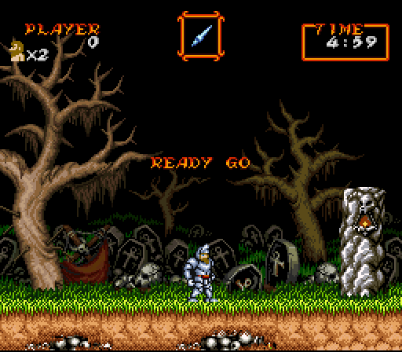
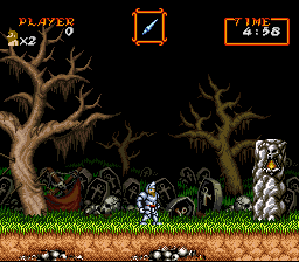

# SNESMASH kit

Put a character from one retro game into another and play it live in the
[Mesen 2](https://www.mesen.ca) emulator: Contra III's hero running and gunning through Super Ghouls
'n Ghosts with his own guns, sounds and moves, while the host game keeps its levels, enemies,
collision and music. No ROM hacking: the host game runs unmodified and Lua scripts steer it every frame.

 

The SNESMASH ports were built by Claude Code, with a person choosing what to make, play-testing it,
and making the calls. **This repo is meant to be handed to your own Claude Code**: it holds the method,
the tools and the mistakes already paid for, so your Claude starts from there.

## Getting started
1. Clone this repo and open Claude Code in it. It reads `CLAUDE.md` on its own.
2. Say what you want, for example: *"Set me up, then let's put Mega Man into Super Castlevania IV."*
3. It walks you through installing Mesen 2 and Python packages, asks you to put **your own** ROM dumps
   in `ROMS/`, runs a smoke test, and plans the port with you in milestones.

You'll need Python 3.10+ and Mesen 2. Bring your own ROMs: this repo contains none and never will.

## What's inside
| | |
|---|---|
| `CLAUDE.md` | directives for Claude Code: how to run a port, hard rules, gotchas |
| `docs/PLAYBOOK.md` | the method, game-independent: architecture, extraction, steering host physics, drawing through the PPU, guest attacks as native host objects, porting sound, recon, testing |
| `docs/MESEN_LUA.md` | Mesen 2 Lua facts and traps |
| `docs/CASE_STUDY.md` | how the Contra-in-Ghouls port went, milestone by milestone |
| `docs/SETUP.md` | setup steps (for Claude to follow with you) |
| `docs/games/` | real notes on Super Ghouls 'n Ghosts, Contra III and Super C (RAM maps, routines, physics) |
| `lua/lib/` | reusable Mesen Lua: draw sprites through the SNES PPU, savestates, screen captures, live title-screen edits, sound-effect capture and playback on another game's sound chip |
| `lua/recon/` | RAM traces, PPU dumps, write-watches, a setup smoke test |
| `lua/template/` | skeleton for a new port: entry script, host adapter, headless test |
| `tools/` | Python: headless runner, RAM search, 65816 disassembler, OAM/VRAM decoder, SNES graphics + screen patcher, sound clip cutter, contact sheets, GIFs |

Mostly SNES-focused (the host games so far were SNES; one guest came from the NES). The method carries
to other consoles Mesen runs; the SNES-specific libraries would need counterparts.

## Legal
Use ROMs you dumped from cartridges you own. Don't share ROMs, savestates or graphics/sound extracted
from games. The code and docs here are original work (MIT licence).
